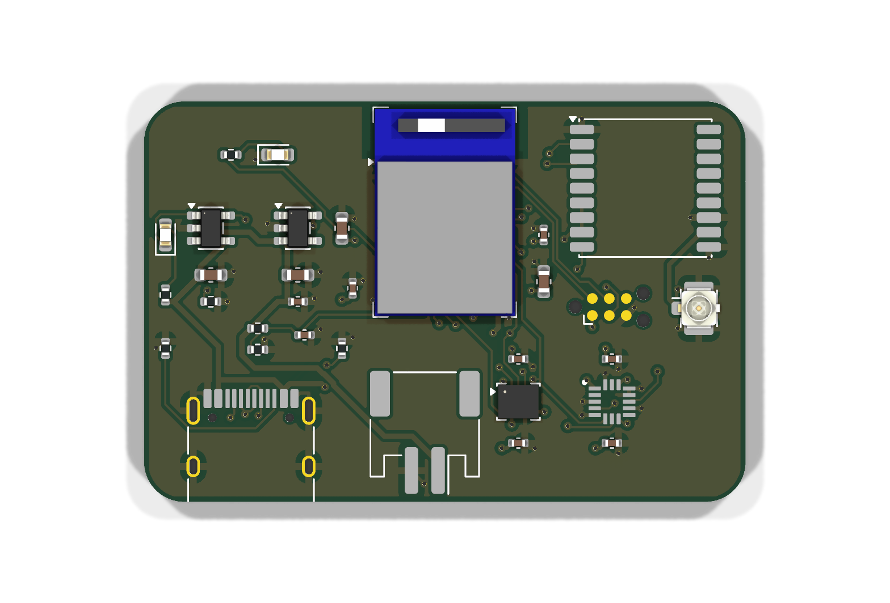
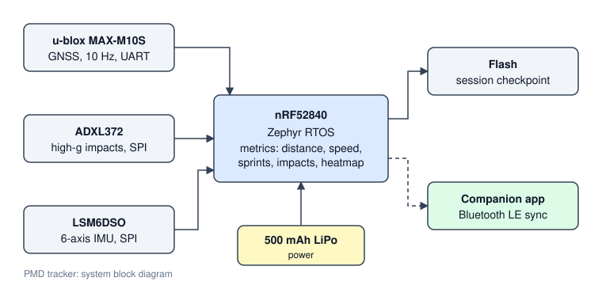

# PMD Tracker

A wearable performance tracker for rugby. It sits in a jersey pouch between the shoulder blades, records a player's match, and syncs the results to a companion app for review after the game.



*KiCad 3D render of the 45 x 30 mm 4-layer board (not yet fabricated).*



## What it measures

| Area | Metrics |
|---|---|
| Locomotion | distance, max speed, sprint count and sprint distance |
| Contact load | impact count, peak g, total load, impacts by intensity band |
| Position | time-on-pitch heatmap (10 m cells), work rate in m/min |

## How it works

1. **Sensing.** A u-blox MAX-M10S GNSS module gives position at 10 Hz. An ADXL372 high-g accelerometer (±200 g) catches impacts that a normal IMU would clip. An LSM6DSO 6-axis IMU is part of the design but is not used by the metrics yet.
2. **On-device metrics.** The nRF52840 runs Zephyr RTOS. Every fix and accel sample goes through [`firmware/lib/metrics`](firmware/lib/metrics), which is portable C:
   - **Position.** Each fix is projected to metres from a pitch origin.
   - **Distance.** Fixes that imply more than 12 m/s are rejected as GNSS glitches. Steps under 0.3 m/s count as standing jitter and add no distance.
   - **Speed and sprints.** Speed is an exponential moving average. A sprint starts above 7 m/s and ends below 6 m/s. It only counts if it lasts at least 1 s.
   - **Impacts.** An impact starts when |a| ≥ 8 g. Samples in the next 250 ms count as the same hit, and its peak is the hit's intensity.
   - **Heatmap.** The time spent at each position is binned into a grid in the pitch frame.
3. **Storage.** A summary checkpoint is written to flash (NVS) every 10 s, so a battery pull mid-match keeps the totals.
4. **Sync.** The device advertises over Bluetooth LE as `PMD`. The app reads one 228-byte summary characteristic (layout in [`metrics.h`](firmware/lib/metrics/metrics.h)). It writes the reset characteristic to start a new session.

Every threshold above sits in one `pmd_config` struct. They are starting values and still need calibrating against real sessions.

## Design targets

The device is designed against World Rugby Law 4.3(m), Regulation 12 and the Player Monitoring Device Performance Specification:

- total mass under 90 g
- no surface radius below 12 mm
- enclosure survives the specification's impact test and 2.5 kN compression test without rupture

| Part | Component |
|---|---|
| MCU | nRF52840 (BLE 5) in a Raytac MDBT50Q-1MV2 module, on a custom 4-layer PCB |
| GNSS | u-blox MAX-M10S, 10 Hz |
| High-g accel | ADXL372 |
| IMU | LSM6DSO |
| Battery | 500 mAh LiPo |

The BOM is in [`hardware/bom.csv`](hardware/bom.csv).

## Hardware

The board is a 45 x 30 mm, 4-layer PCB designed in KiCad 10: [`hardware/kicad`](hardware/kicad).

| Layer | Use |
|---|---|
| F.Cu | parts, signals, GND pour |
| In1.Cu | solid GND plane |
| In2.Cu | 3V3 plane |
| B.Cu | signals, GND pour |

**Power.** USB-C (5.1 kΩ CC pull-downs, so any USB-C charger works) feeds an MCP73831 charger set to about 213 mA (0.4C for the 500 mAh cell). The cell feeds an AP2112K 3.3 V LDO for everything. The GNSS module can draw up to 100 mA at start-up, more than the nRF52840's internal regulator can supply to external parts. A red LED shows charging, and a 1 MΩ / 1 MΩ divider lets firmware read the battery voltage.

**RF.** The module's antenna sits at the top edge, over the footprint's copper keepout. GNSS uses a passive antenna on a u.FL connector next to the MAX-M10S RF pin. The receiver has its own LNA and SAW filter.

**Debug.** SWD on a Tag-Connect TC2030-NL footprint, so there's no connector to fit.

| Signal | nRF52840 pin | To |
|---|---|---|
| SPI SCK / MOSI / MISO | P0.13 / P0.15 / P0.17 | ADXL372, LSM6DSO |
| ADXL372 CS / INT1 | P0.20 / P0.24 | U3 |
| LSM6DSO CS / INT1 | P0.22 / P1.09 | U4 |
| UART TX / RX | P0.06 / P0.08 | MAX-M10S RXD / TXD |
| GNSS reset | P0.27 | MAX-M10S RESET_N |
| Battery sense | P0.04 (AIN2) | VBAT / 2 |
| Status LED | P0.31 | D1 |
| USB D+ / D- | module USB pins | USB-C |

Everything is generated from one file, [`hardware/design.py`](hardware/design.py): parts, nets, placement and track widths. [`hardware/build.sh`](hardware/build.sh) then runs the pipeline:

1. Write the schematic.
2. Run ERC, then check the schematic netlist against `design.py`.
3. Place the parts and add the planes.
4. Autoroute with Freerouting.
5. Run DRC, including schematic parity.
6. Export Gerbers, drill files, the BOM and the renders.

Current results:

- ERC: 0 violations.
- DRC: 0 errors and 0 unconnected items. The only 2 warnings are cosmetic: the USB-C footprint's silkscreen is clipped where the receptacle sits flush with the board edge.
- Schematic parity: 0 issues.

Freerouting gives a different result each run, so `build.sh` retries routing (up to 5 times) until DRC passes, and fails if it never does. The committed board is a checked run.

**Off-board parts** (not on the BOM):

- a 500 mAh single-cell LiPo with a JST PH 2-pin plug
- a passive GNSS patch antenna on a U.FL pigtail
- a Tag-Connect TC2030-NL cable for programming

**Known limits.** There's no power switch: the LDO enable is tied to VBAT, and the firmware doesn't yet use System OFF or GNSS standby, so the cell drains between matches. The board hasn't been fabricated, so nothing here is RF-tested or weighed against the 90 g target.

The ADXL372 footprint isn't in the KiCad library. It's drawn from the land pattern in the ADXL372 datasheet (Rev. C, Figure 111).

Fabrication files: [`hardware/fab/pmd-tracker-gerbers.zip`](hardware/fab/pmd-tracker-gerbers.zip). Design rules are 0.127 mm minimum track and space with 0.6 / 0.3 mm vias, which a standard 4-layer prototype service can make.

## Repository layout

```
firmware/
  lib/metrics/     portable C metrics + host self-test
  src/main.c       Zephyr app: sensors, GNSS, flash checkpoint, BLE service
  boards/          devicetree overlay (nRF52840-DK bring-up wiring)
hardware/
  design.py        parts, nets, placement (single source of truth)
  generate.py      writes the KiCad schematic, libraries and PCB
  build.sh         generate -> ERC -> route -> DRC -> fab outputs
  kicad/           KiCad 10 project (.kicad_sch, .kicad_pcb, custom parts)
  fab/             Gerbers + drill, zipped
  bom.csv
docs/
  block-diagram.svg
  board-top.png, board-bottom.png
```

## Building

Test the metrics on a PC. Any C compiler works:

```
cd firmware/lib/metrics
cc -std=c11 -Wall test_metrics.c metrics.c -lm -o test && ./test
```

Build the firmware (needs Zephyr 4.x and `west`). The nRF52840-DK overlay is used for bring-up:

```
west build -b nrf52840dk/nrf52840 firmware
west flash
```

## Status

- [x] Metrics library with a host self-test
- [ ] Zephyr firmware: GNSS, high-g accel, flash checkpoint, BLE sync (written, not yet built against Zephyr or run on hardware)
- [x] PCB schematic and layout (KiCad): ERC and DRC clean, autorouted. Not yet fabricated or tested.
- [x] Gerbers and drill files
- [ ] Zephyr board definition for the custom PCB. The current overlay targets the nRF52840-DK; see the pin map above.
- [ ] Enclosure
- [ ] Companion app
